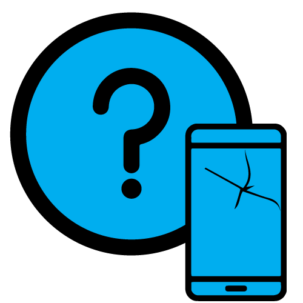
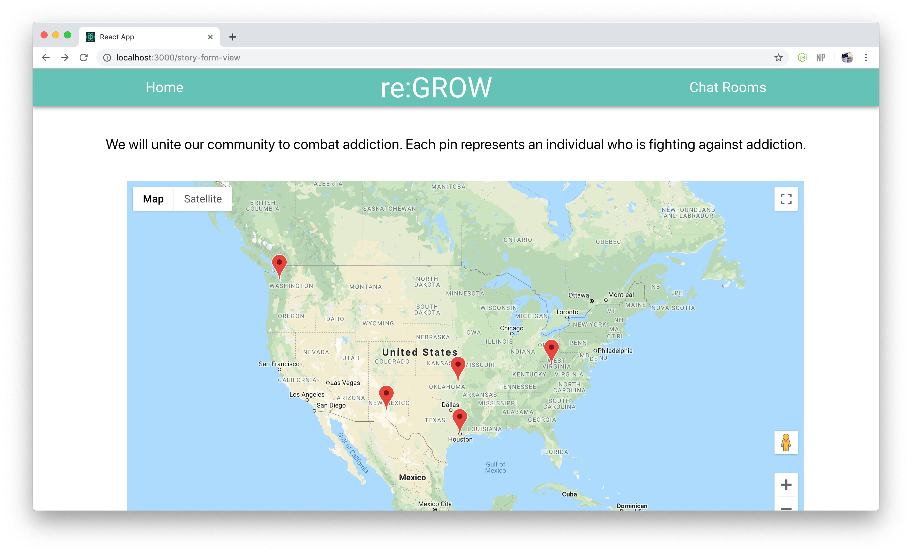
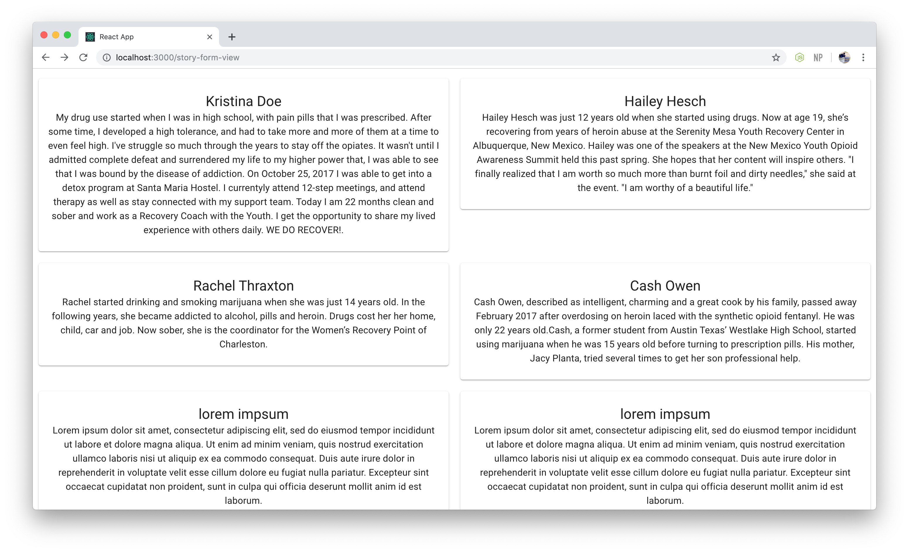
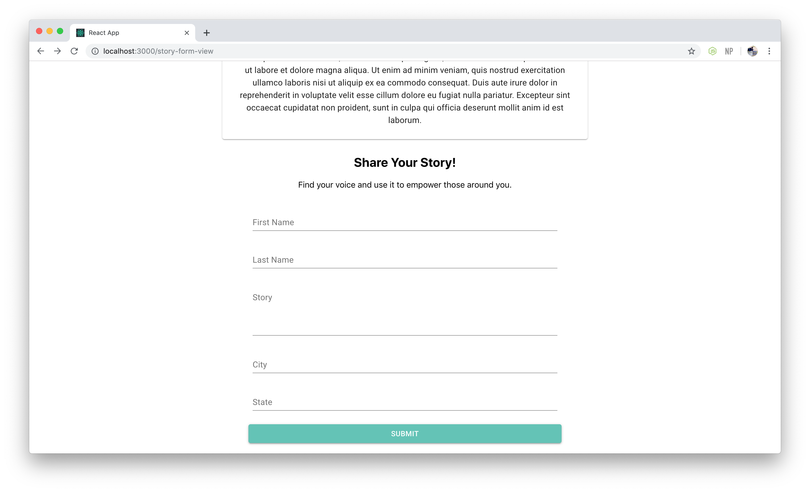
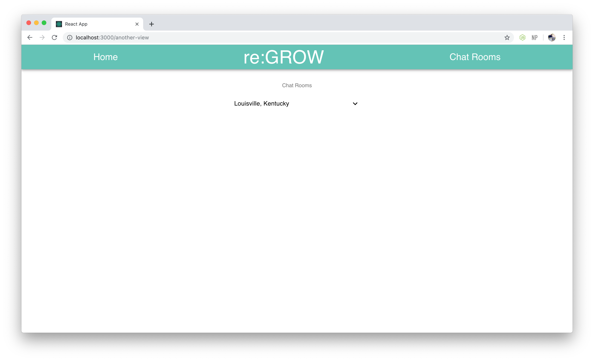
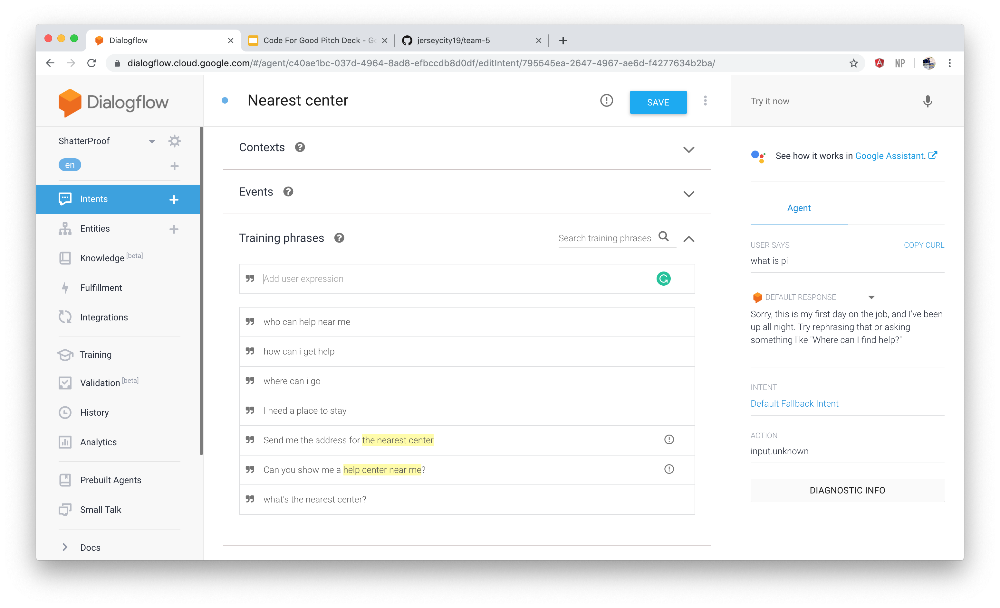
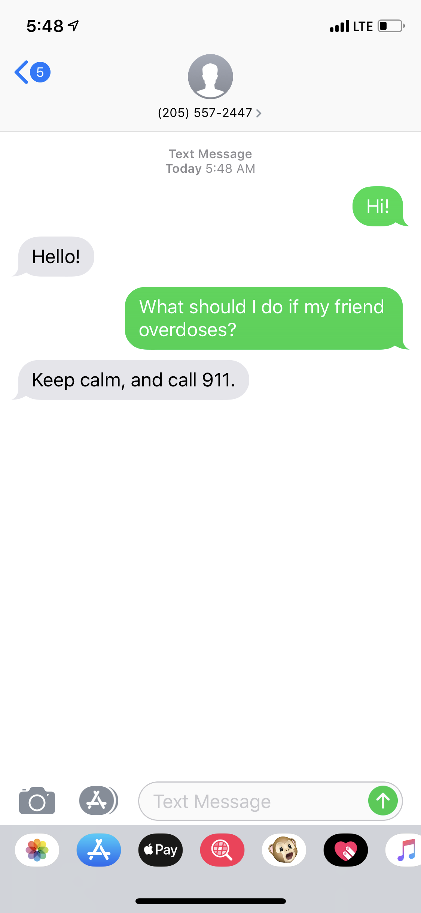

Code for Good Jersey City 2019 - Team #5
======

The project we selected for this hackathon benefits the charity Shatterproof. Shatterproof's mission is to put an end to the addiction epidemic in the United States. Their problem statement for the project is as follows:

"Shatterproof desires to have a strong grassroots network but the organization does not have state or chapter offices throughout the country. Shatterproof would like a mobile-friendly site where people can take action, connect with people locally, and raise funds for Shatterproof. They would like this app to sync with social media platforms – Facebook, Twitter, Instagram, YouTube, LinkedIn, etc. so that content and actions can be shared, and they can expand their network of supporters. Gamification features would be desired to encourage people to take year-round action to earn “status” or prizes. This can take the form of gaining “experience” every time they engage with social media content, getting rewards for recruiting their friends or otherwise incentivizing participation in the events/discussion around Shatterproof’s mission."

We developed an application that intends to meet all of these features. It provides a platform for people who have been affected by addiction to share their stories and to connect with others who have been through similar situations. The application is intended to allow users to connect with others in their community.

This repository contains the frontend/backend code for the team-5 project for the Fall 2019 Code for Good hackathon.

The project is intended to benefit the charity ShatterProof by providing technology that helps to accomplish their mission. 

## Screenshots ##

